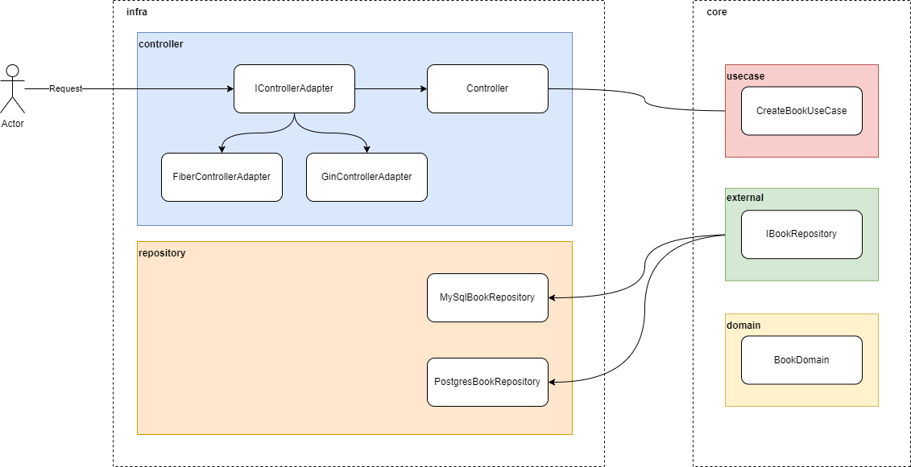

# go-cleanarch-api

## Diagram

The diagram below shows the architectural components that are implemented in this project and how it's integrated each other. 

There are two main groups of components contained by the dotted line boxes. They are **infra** and **core**.

In the **infra** group are all components not related with the application business logic. Here, they are divided in two sub-categories: **controller** and **repository**.

The sub-group **controller** contains the controller of the application, an interface for controller adapters and two implementations of this interface, using each a different web framework, [Gin](https://github.com/gin-gonic/gin) and [Fiber](https://github.com/gofiber/fiber).

The sub-group **repository** contains two implementations of repositories using the databases [MySql](https://www.mysql.com/) and [Postgres](https://www.postgresql.org/). Here is contained all specific vendor implementations to connect to databases, open connections and make operations (select, insert, update, delete, etc).

In the **core** group are all components that are related with the application business logic. Here, they are divired in three sub-categories: **usecase** (business logic), **external** (interfaces to external components) and **domain** (application domain objects).

